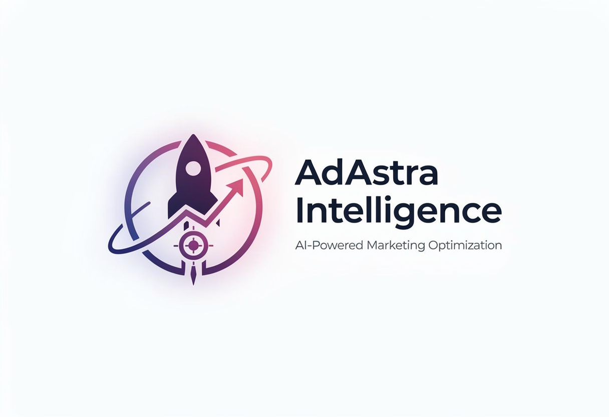
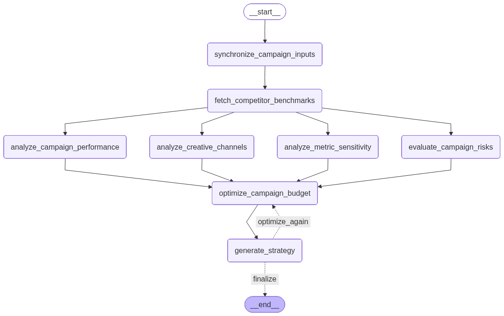

# AdAstra Intelligence: AI-Powered Marketing Optimization System 🎯

[](https://opensource.org/licenses/MIT)
[](https://www.python.org/)
[](https://streamlit.io/)
[](https://github.com/langchain-ai/langgraph)

**AdAstra Intelligence** is a pioneering marketing analytics and optimization platform. It harnesses the power of **LangGraph**, **Mathematical Optimization (CVXPY)**, and **Multi-Agent Orchestration** to transform raw campaign data into high-octane marketing strategies.

Built for the modern marketer, AdAstra moves beyond historical reporting: it uses AI to tell you exactly how to reallocate your next $1,000,000 for maximum impact.



---

## 🚀 Key Features

### 1. **Multi-Agent Optimization Workflow**
Built on a sophisticated **LangGraph** architecture, the system orchestrates specialized AI agents:
- **Diagnostic Agent**: Evaluates campaign metrics against dynamically fetched industry benchmarks.
- **Risk Analyst Agent**: Combines heuristics and LLM intelligence to identify high-risk or underperforming campaigns.
- **Sensitivity Agent**: Uses vectorized calculations to pinpoint exactly which metrics are driving your ROI.
- **Creative Consultant**: Delivers actionable suggestions for your channel mix and creative asset improvements.

### 2. **Mathematical Budget Reallocation**
AdAstra goes beyond simple heuristics. It utilizes the **CVXPY** library with the **Clarabel solver** to perform precision-engineered mathematical optimization. The system reallocates your total budget across all campaigns to maximize your target KPIs while respecting real-world constraints such as non-negativity and historical spend variance.

### 3. **Premium Analytics Dashboard**
A professional-grade UI experience crafted with Streamlit and custom CSS:
- **Glassmorphism Design**: Experience the future with frosted glass cards, elegant backdrop blurs, and animated gradients.
- **Interactive Visualizations**: Dive into Conversion Funnels, Performance Quadrants, Efficiency Frontiers, and Reach & Impact bubble charts.
- **Real-time Persistence**: Your progress is automatically saved to disk, ensuring your analysis remains intact even after a page reload.

### 4. **Executive-Ready Reporting**
Generate and download high-impact **PDF reports** powered by `ReportLab`. Reports include:
- **Global Performance Overview**: BI-grade KPI summaries for quick decision-making.
- **Embedded Visualizations**: All dashboard charts are rendered as high-resolution images within your PDF.
- **Strategic Blueprints**: AI-generated executive summaries and tactical action plans ready for the boardroom.

---

## 🧠 The Optimization Workflow (LangGraph)

The system operates through a sophisticated directed acyclic graph (DAG) with intelligent conditional looping:

1.  **Synchronization**: Normalizes user inputs and validates data schemas through Pydantic.
2.  **Benchmarking**: Dynamically generates channel-specific benchmarks using GPT-4o-mini.
3.  **Parallel Analysis (Map Stage)**: 
    *   Performance Diagnostics
    *   Risk Evaluation
    *   Metric Sensitivity Calculation
    *   Creative Asset Suggestions
4.  **Budget Optimization (Reduce Stage)**: Solves the optimal budget distribution using mathematical constraints.
5.  **Strategy Synthesis**: Aggregates all agent outputs into a unified and cohesive strategy report.
6.  **Conditional Refinement**: Evaluates results: if your targets (such as ROAS >= 3.0) aren't met, the system can loop back for further optimization.



---

## 🛠️ Technical Stack

- **Frontend**: Streamlit with advanced CSS and HTML injection
- **Orchestration**: LangChain and LangGraph
- **Optimization**: CVXPY (Clarabel Solver) and NumPy
- **Visuals**: Plotly Express and GraphObjects
- **Reporting**: ReportLab
- **Image Handling**: Kaleido and Cairo
- **Data Validation**: Pydantic v2
- **Persistence**: JSON-based local storage

---

## 📥 Installation

1. **Clone the repository**:
   ```bash
   git clone https://github.com/SayamAlt/AdAstra---Marketing-Intelligence-Engine-using-LangGraph
   cd AdAstra---Marketing-Intelligence-Engine-using-LangGraph
   ```

2. **Set up Virtual Environment**:
   ```bash
   python -m venv venv
   source venv/bin/activate  # Mac/Linux
   ```

3. **Install Dependencies**:
   ```bash
   pip install -r requirements.txt
   ```

4. **Environment Variables**:
   Create a `.env` file or use Streamlit secrets:
   ```env
   OPENAI_API_KEY=your_key_here
   ```

---

## 🖥️ Usage Guide

### 1. **Campaign Input**
Begin in the **Campaign Orchestration** tab. Enter your campaign metadata, financial performance data, and engagement metrics.

### 2. **AI Execution**
Use the sidebar to define your **Optimization Targets**, such as maximizing ROAS or minimizing CPA. Adjust metric weights to align with your specific business goals, then click **🚀 Execute Optimization**.

### 3. **Insight Analysis**
- Visit the **Performance Analytics** tab for multi-dimensional chart breakdowns.
- Explore the **Strategic Blueprint** for tactical recommendations and proactive risk surveillance.

### 4. **Professional Output**
Download the **Analytics PDF** or the **Strategic Blueprint PDF** to share your insights with stakeholders or showcase your work to prospective employers.

---

## 📄 License

This project is licensed under the MIT License: see the [LICENSE](LICENSE) file for details.

---

## 👨‍💻 Author

**Sayam Kumar**  
*Data Scientist & AI Engineer*  
[LinkedIn](https://linkedin.com/in/sayamkumar) | [GitHub](https://github.com/sayamkumar)
